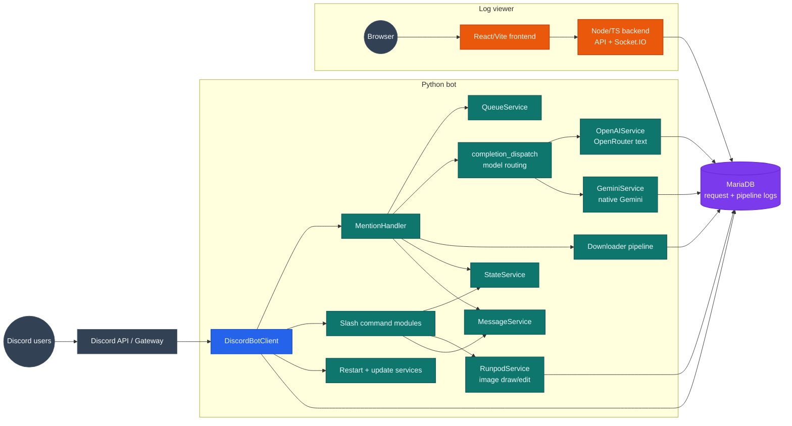
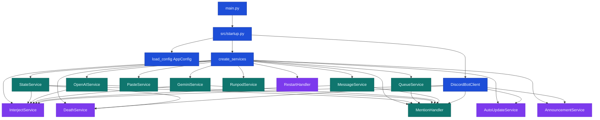
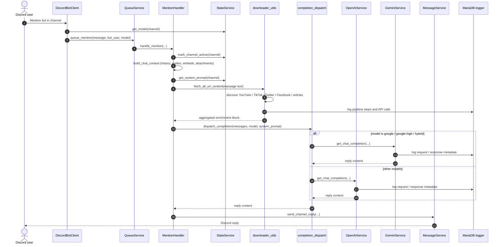
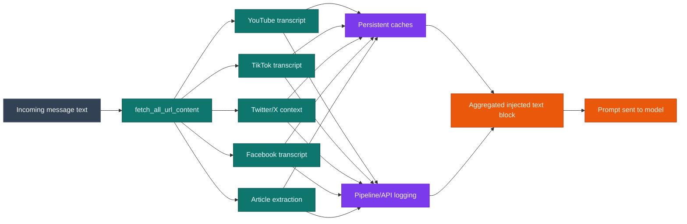
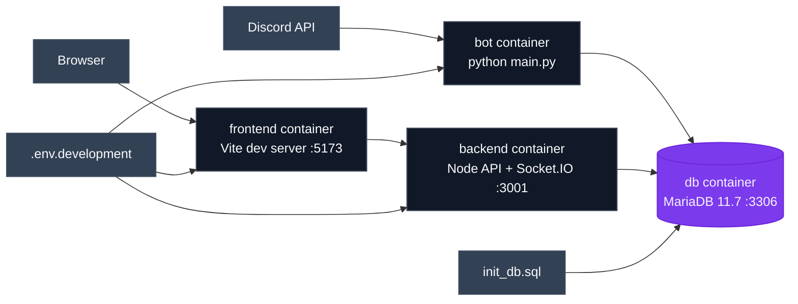

# Architecture

This page is meant to answer four questions quickly:

1. **What are the main moving parts?**
2. **How does a mention turn into a reply?**
3. **Which services are wired together at startup?**
4. **How do the bot, database, and log viewer fit together in development?**

## Read this page like a map

| Section | Use it when you want to... |
| --- | --- |
| System architecture | Orient yourself to the whole stack |
| Service wiring at startup | See what `src/startup.py` actually constructs |
| Mention pipeline | Understand the primary request path |
| Downloader enrichment flow | Understand where transcript/article data comes from |
| Docker/runtime layout | Visualize the development stack |
| Component map | Jump straight to the file you likely need |

## Diagram: system architecture

What it shows:

- the Python bot as the center of Discord interaction
- OpenRouter/Runpod/downloader work feeding MariaDB logging
- the separate log-viewer backend/frontend path

## Diagram: service wiring at startup

What it shows:

- `main.py` -> `src/startup.py`
- the services created by `create_services()`
- how those services are injected into the Discord client

## Diagram: mention pipeline

This is the single most important runtime path in the app.

### What matters about this flow

- Mentions are **queued**, not processed in parallel ad hoc.
- Prompt context is more than just the latest message: it includes recent history, reply metadata, embeds, and attachments. The multimodal context array is built by `src/utils/chat_context.py` (`build_chat_context`), shared with the interject service.
- Model routing is centralized in `src/services/completion_dispatch.py`: `google`/`google-high` go to `GeminiService`, `hybrid` runs a two-phase Gemini-then-OpenRouter pipeline, and everything else goes to `OpenAIService`.
- URL enrichment happens **before** the LLM call and can materially change the prompt content.
- Logging is first-class: downloader and model activity both emit records consumed later by the log viewer.

## Diagram: downloader enrichment flow

### Current enrichment sources

| Source | Helper | Notes |
| --- | --- | --- |
| YouTube | `src/utils/youtube_utils.py` | Transcript extraction with optional proxy assistance |
| TikTok | `src/utils/tiktok_utils.py` | Thin wrapper over `src/utils/media_transcribe.py` (yt-dlp download -> Groq transcription) |
| Twitter/X | `src/utils/twitter_utils.py` | Tweet/context lookup, with optional video transcription path |
| Facebook | `src/utils/facebook_utils.py` | Thin wrapper over `src/utils/media_transcribe.py` (yt-dlp download -> Groq transcription) |
| Generic articles | `src/utils/url_utils.py` | `httpx` fetch plus content extraction/fallbacks |
| Shared media pipeline | `src/utils/media_transcribe.py` | yt-dlp audio download + proxy fallback + Groq Whisper transcription, used by TikTok/Facebook |

## Diagram: docker/runtime layout

## Component map

| Path | Role | Open this when you need to... |
| --- | --- | --- |
| `main.py` | Boot entrypoint | See how process startup/shutdown begins |
| `src/startup.py` | Service factory | Understand the dependency graph |
| `src/config.py` | Config loading/defaults | Confirm env vars and defaults |
| `src/bot/client.py` | Discord client orchestration | See event handlers, command setup, service startup/shutdown |
| `src/bot/handlers/mention.py` | Main conversational path | Debug context assembly or mention behavior |
| `src/bot/commands/` | Slash commands | Inspect user-facing command behavior |
| `src/utils/chat_context.py` | Multimodal context builder | Change how history/embeds/attachments become the model input (shared by mention + interject) |
| `src/services/completion_dispatch.py` | Model routing | Understand hybrid/Gemini/OpenRouter selection (shared by mention + interject) |
| `src/services/openai_service.py` | Text-model integration | Understand OpenRouter calls |
| `src/services/gemini_service.py` | Native Gemini integration | Understand `google`/`google-high`/`hybrid` calls and the Gemini timeout |
| `src/services/runpod_service.py` | Image integration | Understand draw/edit requests |
| `src/services/state_service.py` | Per-channel persistence | See where model/system-prompt/service settings live |
| `src/services/queue_service.py` | FIFO work queue | Understand serialized mention processing |
| `src/db/logger.py` | Request/pipeline logging | Understand what reaches MariaDB |
| `src/db/connection.py` | DB pool wiring | Debug MariaDB connectivity |
| `log-viewer/backend/` | Log API service | Debug auth, socket streaming, DB reads |
| `log-viewer/frontend/` | Log UI | Debug frontend behavior and envs |

## End-to-end narrative

### Startup

1. `main.py` loads configuration and starts the app.
2. `src/startup.py` constructs the service graph.
3. `DiscordBotClient` receives those services, sets callbacks, registers commands, and boots Discord event handling.

### Mention reply

1. A user mentions the bot.
2. `DiscordBotClient` chooses the active model for the channel and queues the work.
3. `MentionHandler` gathers recent message history and reply context (via `build_chat_context`).
4. The handler enriches user text with downloader output for supported URLs.
5. `dispatch_completion` routes the assembled context to `OpenAIService` (OpenRouter), `GeminiService` (native Gemini), or the two-phase `hybrid` pipeline, based on the channel's model.
6. `MessageService` sends the final reply back to Discord.
7. Request and pipeline details are written to MariaDB.

### Observability

1. The log-viewer backend reads MariaDB logs and serves them over HTTP.
2. It also emits realtime updates over Socket.IO.
3. The React frontend authenticates, fetches recent logs, and subscribes to updates.

## Key architectural traits

- **Mention-first UX:** the primary conversational surface is normal Discord chat, not a slash command.
- **Service composition over globals:** `src/startup.py` explicitly wires the main collaborators.
- **Logging as a product feature:** MariaDB logging is not incidental; it powers a dedicated inspection UI.
- **Hybrid stack:** Python handles bot/runtime behavior, while Node/React handle log inspection.
