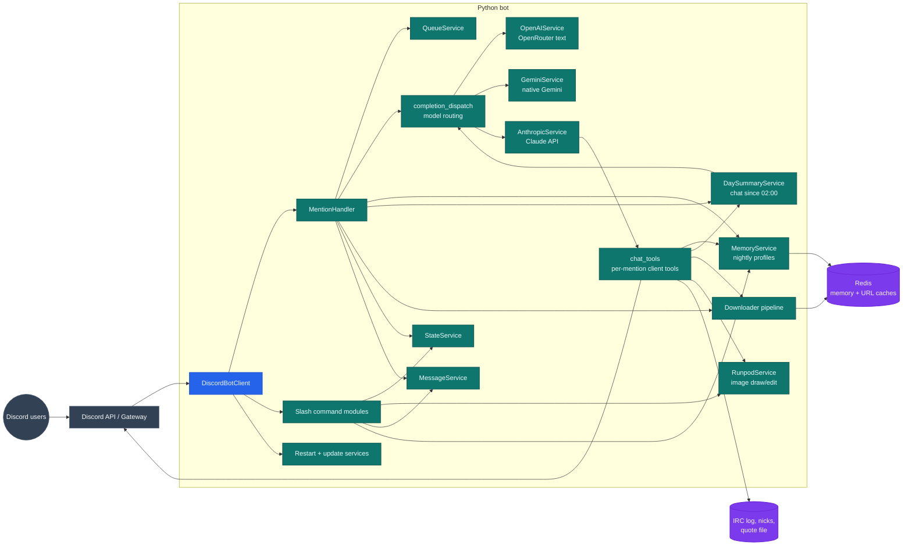
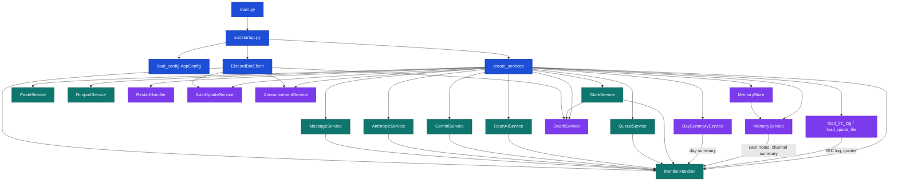
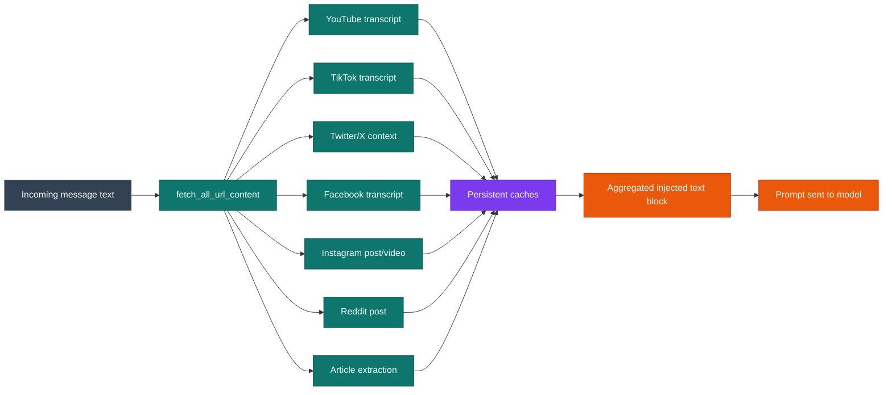
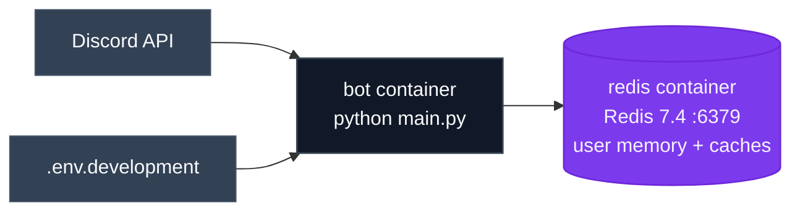

# Architecture

This page is meant to answer four questions quickly:

1. **What are the main moving parts?**
2. **How does a mention turn into a reply?**
3. **Which services are wired together at startup?**
4. **How do the bot and Redis fit together in development?**

## Read this page like a map

| Section | Use it when you want to... |
| --- | --- |
| System architecture | Orient yourself to the whole stack |
| Service wiring at startup | See what `src/startup.py` actually constructs |
| Mention pipeline | Understand the primary request path |
| Claude API tools | See what the direct models can call, and how to add a tool |
| Downloader enrichment flow | Understand where transcript/article data comes from |
| Docker/runtime layout | Visualize the development stack |
| Component map | Jump straight to the file you likely need |

## Diagram: system architecture

What it shows:

- the Python bot as the center of Discord interaction
- OpenRouter/Gemini/Claude API, Runpod, and downloader work around the mention path
- Redis for per-user memory and content caches

```mermaid
flowchart LR
    classDef edge fill:#334155,color:#f8fafc,stroke:#475569,stroke-width:1px;
    classDef bot fill:#2563eb,color:#eff6ff,stroke:#1d4ed8,stroke-width:1.5px;
    classDef service fill:#0f766e,color:#ecfeff,stroke:#115e59,stroke-width:1.5px;
    classDef data fill:#7c3aed,color:#f5f3ff,stroke:#6d28d9,stroke-width:1.5px;

    User((Discord users)):::edge --> Discord[Discord API / Gateway]:::edge

    subgraph BotApp[Python bot]
        Client[DiscordBotClient]:::bot
        Mention[MentionHandler]:::service
        Commands[Slash command modules]:::service
        Queue[QueueService]:::service
        State[StateService]:::service
        Dispatch[completion_dispatch<br/>model routing]:::service
        OpenAI[OpenAIService<br/>OpenRouter text]:::service
        Gemini[GeminiService<br/>native Gemini]:::service
        Anthropic[AnthropicService<br/>Claude API]:::service
        Tools[chat_tools<br/>per-mention client tools]:::service
        Memory[MemoryService<br/>nightly profiles]:::service
        DaySummary[DaySummaryService<br/>chat since 02:00]:::service
        Runpod[RunpodService<br/>image draw/edit]:::service
        Downloader[Downloader pipeline]:::service
        MsgSvc[MessageService]:::service
        Restart[Restart + update services]:::service
    end

    Discord --> Client
    Client --> Mention
    Client --> Commands
    Mention --> Queue
    Mention --> Dispatch
    Dispatch --> OpenAI
    Dispatch --> Gemini
    Dispatch --> Anthropic
    Mention --> Memory
    Mention --> DaySummary
    DaySummary --> Dispatch
    Mention --> Downloader
    Mention --> State
    Mention --> MsgSvc
    Commands --> State
    Commands --> Runpod
    Commands --> MsgSvc
    Client --> Restart

    Commands --> Memory
    Anthropic --> Tools
    Tools --> Memory
    Tools --> DaySummary
    Tools --> Downloader
    Tools --> Runpod

    Cache[(Redis<br/>memory + URL caches)]:::data
    Files[(IRC log, nicks,<br/>quote file)]:::data
    Memory --> Cache
    Downloader --> Cache
    Tools --> Files
    Tools --> Discord
```

## Diagram: service wiring at startup

What it shows:

- `main.py` -> `src/startup.py`
- the services created by `create_services()`
- how those services are injected into the Discord client

```mermaid
flowchart TB
    classDef core fill:#1d4ed8,color:#eff6ff,stroke:#1e40af,stroke-width:1.5px;
    classDef svc fill:#0f766e,color:#ecfeff,stroke:#115e59,stroke-width:1.2px;
    classDef aux fill:#7c3aed,color:#f5f3ff,stroke:#6d28d9,stroke-width:1.2px;

    Main[main.py]:::core --> Startup[src/startup.py]:::core
    Startup --> Config[load_config AppConfig]:::core
    Startup --> Factory[create_services]:::core
    Factory --> State[StateService]:::svc
    Factory --> Queue[QueueService]:::svc
    Factory --> OpenAI[OpenAIService]:::svc
    Factory --> Gemini[GeminiService]:::svc
    Factory --> Anthropic[AnthropicService]:::svc
    Factory --> Paste[PasteService]:::svc
    Factory --> Message[MessageService]:::svc
    Factory --> Runpod[RunpodService]:::svc
    Factory --> Restart[RestartHandler]:::aux
    Factory --> AutoUpdate[AutoUpdateService]:::aux
    Factory --> Announce[AnnouncementService]:::aux

    Factory --> Death[DeathService]:::aux
    Factory --> MemStore[MemoryStore]:::aux
    Factory --> Memory[MemoryService]:::aux
    Factory --> DaySummary[DaySummaryService]:::aux
    Factory --> Mention[MentionHandler]:::svc
    Factory --> IrcLog[load_irc_log / load_quote_file]:::aux
    IrcLog -->|IRC log, quotes| Mention

    MemStore --> Memory
    Memory -->|user notes, channel summary| Mention
    DaySummary -->|day summary| Mention


    State --> Death
    State --> Mention
    Queue --> Mention

    OpenAI --> Mention

    Gemini --> Mention

    Anthropic --> Mention

    Message --> Mention

    Startup --> Client[DiscordBotClient]:::core
    Client --> Mention
    Client --> AutoUpdate
    Client --> Announce

    Client --> Death
```

## Diagram: mention pipeline

This is the single most important runtime path in the app.

```mermaid
sequenceDiagram
    autonumber
    actor U as Discord user
    participant C as DiscordBotClient
    participant Q as QueueService
    participant M as MentionHandler
    participant S as StateService
    participant D as downloader_utils
    participant DP as completion_dispatch
    participant O as OpenAIService
    participant G as GeminiService
    participant A as AnthropicService
    participant MS as MessageService
    participant MEM as MemoryService

    U->>C: Mention bot in channel
    C->>S: get_model(channel)
    C->>Q: queue_mention(message, bot_user, model)
    Q->>M: handle_mention(...)
    M->>S: mark_channel_active(channel)
    M->>M: build_chat_context (history, replies, embeds, attachments)
    M->>S: get_system_prompt(channel)
    alt model has tools (sonnet/opus-5.5-direct)
        M->>M: add "Your tools" section, build_mention_tools(message)
    else other models
        M->>D: fetch_all_url_content(text) per message, concurrently
        D-->>M: enrichment (newest 10 messages fetch; older ones use cache only)
        M->>MEM: get_notes_block(asker, mentioned users, recent speakers)
        MEM-->>M: profiles appended to the mention
        Note over M: channel summary, day summary and how_i_work go in the system prompt
    end
    M->>DP: dispatch_completion(messages, model, system_prompt, tools)
    alt model is google / google-high
        DP->>G: get_chat_completion(...)
        G-->>DP: reply content
    else model is sonnet/opus-5.5-direct
        DP->>A: get_chat_completion(...)
        loop up to 6 tool rounds
            A->>A: run tool_use blocks (ChatTool.run), send tool_result back
        end
        A-->>DP: reply content (+ files from draw/edit_image)
    else other models
        DP->>O: get_chat_completion(...)
        O-->>DP: reply content
    end
    Note over A,O: streamed: on_text(text so far) posts, then edits, a preview
    DP-->>M: reply content
    M->>MS: StreamingReply.finish: edit preview into final reply (or send it)
    MS-->>U: Discord reply
```

### What matters about this flow

- Mentions are **queued**, not processed in parallel ad hoc.
- Prompt context is more than just the latest message: it includes recent history, reply metadata, embeds, and attachments. The multimodal context array is built by `src/utils/chat_context.py` (`build_chat_context`).
- Model routing is centralized in `src/services/completion_dispatch.py`: `google`/`google-high` go to `GeminiService`, `sonnet-5.5-direct`/`opus-5.5-direct` go to `AnthropicService` (Claude API), and everything else goes to `OpenAIService`.
- URL enrichment happens **before** the LLM call and can materially change the prompt content. Only the newest 10 history messages fetch links; older messages use cached results only, and the fetches run concurrently.
- Per-user memory profiles are appended to the end of the mention, so the cached system prompt and history stay unchanged.
- So is the bot's own state (`<about_you>`: mood, interests, what it's wondering about, and follow-ups for the people in the conversation), on every model. It's per server in `cmwgpt:self:<guild_id>`, seeded from the last 7 days when missing and refreshed every 6 hours from the last 12 hours of chat, both with a web search for current events; the direct models can also change it with `update_self` and `follow_up`. When the `DISCORD_CHANNEL_ID` channel has been quiet for an hour (9:00 to 22:00 Denver; never other channels, and off when unset), the same loop pings the most recent speaker there who has a follow-up, asking about it in the bot's voice, and drops it; it won't do that again until someone other than a bot talks (`idle_ask` in the hash records the last one).
- The Claude API direct models get none of the on-demand context filled in (links, memory notes, channel and day summaries, `how_i_work`). They get a "Your tools" section in the system prompt instead and fetch what they need with tools; see [Claude API tools](#claude-api-tools).
- Claude API and OpenRouter replies stream: `StreamingReply` (`src/services/streaming_reply.py`) posts the reply as it arrives and edits it at most every 1.5 seconds, then edits in the final text with the cost. If the request fails, the partial message is deleted before the error reply. Gemini replies arrive whole.
- There is no request/pipeline log table: the SDK clients use their default HTTP clients, and diagnostics go to the normal Python log (stdout and `logs/`).

## Claude API tools

The direct models (`sonnet-5.5-direct`, `opus-5.5-direct`) are offered client tools on top of server-side web search. `MentionHandler._build_tools` calls `build_mention_tools` (`src/services/chat_tools.py`) once per mention; the handlers are closures over that mention's guild, channel and asker, so per-reply limits (like 2 images) and permission checks need no shared state. `AnthropicService.get_chat_completion` runs the tool loop: a round's `tool_use` blocks run concurrently, each `ToolResult` goes back as a `tool_result` in the order the calls were made, costs are added to the reply's cost and files are attached to the reply. Limits that span calls (images, reactions) are counted before each tool's first `await`, so calls running side by side can't overshoot them. After 6 rounds `tool_choice` is set to `none` so the model has to answer.

Requests with client tools also get Anthropic's server-side code execution (`code_execution_20260521`), besides web search. The reply reuses one container across its requests, and files the code saves (`bash_code_execution_output` blocks) are downloaded through the Files API and attached to the reply (`AnthropicService._download_code_files`).

A tool is left out when its dependency isn't configured (no `IRC_LOG` means no IRC tools, no guild means no Discord search, and so on), so the tool list, and with it the cached tools prefix, is fixed for a given channel.

| Tool | Runs | Needs |
| --- | --- | --- |
| `draw`, `edit_image` | `src/services/image_service.py` (Gemini or Runpod) | a draw/edit model, Gemini or Runpod |
| `recall_users`, `recall_channel`, `remember`, `update_self`, `follow_up` | `MemoryService` | Redis memory, a guild |
| `recall_today` | `DaySummaryService` | — |
| `search_messages`, `read_messages`, `view_images` | `src/services/discord_history.py` (Discord's message search) and message fetches | a guild |
| `react` | `add_reaction` on a message in the mention's channel (5 per reply; the tools section lists the server's custom emoji) | a guild |
| `search_irc_log`, `read_irc_log_day`, `count_irc_log` | `src/services/irc_log_service.py` (memory-mapped log) | `IRC_LOG` (`IRC_NICKS` optional) |
| `old_quotes` | `src/services/quote_service.py` | `OLD_QUOTE_BOT` |
| `read_urls` | `fetch_all_url_content` (same fetchers and cache as enrichment), for any URL, including web search results; used instead of the API's `web_fetch` so links go through the site-specific fetchers | — |
| `wiki_pageviews` | `DeathService.get_avg_monthly_views` | — |
| `how_i_work` | `src/prompts/how_i_work.txt` | — |
| `think_harder` (opus only) | handled inside `AnthropicService`: discards the reply and re-asks at high effort | — |

### Adding a tool

1. In `src/services/chat_tools.py`, add the `*_TOOL` definition (strict JSON schema), a `*_GUIDANCE` bullet for the system prompt's "Your tools" section, and a handler inside `build_mention_tools`. Register it with `ChatTool(definition, handler, status, guidance)`; `status` is what the reply preview shows while it runs.
2. Pass any new dependency through `MentionHandler.__init__` and `_build_tools`, and wire it in `src/startup.py`. Leave the tool out when the dependency is missing.
3. Treat anything other people wrote (messages, pages, logs, quotes) as material, not instructions; if the tool returns such text, add its name to the set at the end of `MentionHandler._tools_addon` that adds the warning.
4. Describe it in `src/prompts/how_i_work.txt` (see `.agents/rules/keep-how-i-work-current.md`) and in the table above.
5. Test the handler in `tests/test_chat_tools.py`; `test_every_tool_is_named_in_the_prompt_guidance` fails if the tool has no guidance.

## Diagram: downloader enrichment flow

```mermaid
flowchart LR
    classDef in fill:#334155,color:#f8fafc,stroke:#475569,stroke-width:1px;
    classDef src fill:#0f766e,color:#ecfeff,stroke:#115e59,stroke-width:1.2px;
    classDef cache fill:#7c3aed,color:#f5f3ff,stroke:#6d28d9,stroke-width:1.2px;
    classDef out fill:#ea580c,color:#fff7ed,stroke:#c2410c,stroke-width:1.2px;

    Msg[Incoming message text]:::in --> Discover[fetch_all_url_content]:::src
    Discover --> YT[YouTube transcript]:::src
    Discover --> TT[TikTok transcript]:::src
    Discover --> TW[Twitter/X context]:::src
    Discover --> FB[Facebook transcript]:::src
    Discover --> IG[Instagram post/video]:::src
    Discover --> RD[Reddit post]:::src
    Discover --> AR[Article extraction]:::src

    YT --> Cache[Persistent caches]:::cache
    TT --> Cache
    TW --> Cache
    FB --> Cache
    IG --> Cache
    RD --> Cache
    AR --> Cache

    Cache --> Aggregate[Aggregated injected text block]:::out
    Aggregate --> Prompt[Prompt sent to model]:::out
```

### Current enrichment sources

| Source | Helper | Notes |
| --- | --- | --- |
| YouTube | `src/utils/youtube_utils.py` | Transcript extraction with optional proxy assistance |
| TikTok | `src/utils/tiktok_utils.py` | Thin wrapper over `src/utils/media_transcribe.py` (yt-dlp download -> Groq transcription) |
| Twitter/X | `src/utils/twitter_utils.py` | Tweet/context lookup, with optional video transcription path |
| Facebook | `src/utils/facebook_utils.py` | Thin wrapper over `src/utils/media_transcribe.py` (yt-dlp download -> Groq transcription) |
| Instagram | `src/utils/instagram_utils.py` | Post lookup through RapidAPI (with images), videos through `media_transcribe.py` |
| Reddit | `src/utils/reddit_utils.py` | Post details through RapidAPI (`reddit34` `getPostDetails`): title, subreddit, author, score, flair, text, linked URL and up to 4 images (gallery or preview). Post links skip the article fetcher; other Reddit pages still use it |
| Generic articles | `src/utils/url_utils.py` | `fetch_public` fetch, then `trafilatura` extraction (retried with `favor_recall` if the first pass finds nothing) |
| Shared media pipeline | `src/utils/media_transcribe.py` | yt-dlp or direct video download (3-minute limit) + proxy fallback, audio encoded at 16 kHz mono 32 kbps (what Whisper uses anyway; ~1h50m per 25 MB upload), longer audio split into 30-minute chunks, Groq Whisper transcription (near-instant). No length limit. Used by TikTok/Facebook/Twitter/Instagram and big Discord audio attachments |

### Fetching and caching

- Outbound fetches of user-supplied URLs go through `fetch_public` / `download_public` in `src/utils/http_client.py`. The SSRF guard (`src/utils/ssrf_guard.py`, which blocks every non-global address) is re-checked on each redirect hop, response bodies are size-capped, and each fetch has an overall timeout.
- Results are kept in Redis (`cmwgpt:cache:<name>:<key>`), each entry expiring 30 days after it was last used; image data URLs expire after 7 days. Tweet and Instagram caches still store images as base64. If Redis is down they fall back to memory.

## Diagram: docker/runtime layout

```mermaid
flowchart LR
    classDef ext fill:#334155,color:#f8fafc,stroke:#475569,stroke-width:1px;
    classDef ctr fill:#111827,color:#f9fafb,stroke:#374151,stroke-width:1.4px;
    classDef db fill:#7c3aed,color:#f5f3ff,stroke:#6d28d9,stroke-width:1.4px;

    Discord[Discord API]:::ext --> Bot[bot container<br/>python main.py]:::ctr
    Bot --> Redis[(redis container<br/>Redis 7.4 :6379<br/>user memory + caches)]:::db

    Env[.env.development]:::ext --> Bot
```

## Component map

| Path | Role | Open this when you need to... |
| --- | --- | --- |
| `main.py` | Boot entrypoint | See how process startup/shutdown begins |
| `src/startup.py` | Service factory | Understand the dependency graph |
| `src/config.py` | Config loading/defaults | Confirm env vars and defaults |
| `src/bot/client.py` | Discord client orchestration | See event handlers, command setup, service startup/shutdown |
| `src/bot/handlers/mention.py` | Main conversational path | Debug context assembly or mention behavior |
| `src/bot/commands/` | Slash commands | Inspect user-facing command behavior |
| `src/utils/chat_context.py` | Multimodal context builder | Change how history/embeds/attachments become the model input |
| `src/services/completion_dispatch.py` | Model routing | Understand Gemini/Claude API/OpenRouter selection |
| `src/services/model_catalog.py` | `/model` options | Add a text model or see which key each one needs |
| `src/services/anthropic_service.py` | Claude API integration | Debug prompt caching, the tool loop, `think_harder` or pricing |
| `src/services/chat_tools.py` | Client tools for the direct models | Add or change a tool and its prompt guidance |
| `src/services/discord_history.py` | Discord message search/read | Debug `search_messages` / `read_messages` |
| `src/services/irc_log_service.py` | Old IRC log search/count | Debug the IRC tools or nick merging |
| `src/services/quote_service.py` | Old quote bot file | Debug `old_quotes` |
| `src/services/day_summary_service.py` | Today's chat summary, saved to Redis so restarts keep it | Understand the incremental day summary |
| `src/services/cost_service.py` | `record_cost`, per-reply cost scopes and the daily Redis tallies behind `/cost` | Add a paid API or change how costs are counted |
| `src/services/image_service.py` | Image model routing | See which image models go to Gemini vs Runpod |
| `src/services/streaming_reply.py` | Streamed reply preview | Debug status lines, edits and the final reply |
| `src/services/openai_service.py` | Text-model integration | Understand OpenRouter calls |
| `src/services/gemini_service.py` | Native Gemini integration | Understand `google`/`google-high` calls and the Gemini timeout |
| `src/services/runpod_service.py` | Image integration | Understand draw/edit requests |
| `src/services/state_service.py` | Per-channel persistence | See where model/system-prompt/service settings live |
| `src/services/queue_service.py` | FIFO work queue | Understand serialized mention processing |
| `src/services/memory_service.py` | Per-user memory | Understand the nightly job, `/memory` edits, and the notes added to mentions |
| `src/db/memory_store.py` | Memory in Redis | Understand the memory keys and the 100 KB cap |
| `src/db/redis_client.py` | Redis clients | Debug Redis connectivity |
| `src/utils/http_client.py` | Guarded outbound fetches | Debug redirects, size caps, and fetch timeouts |
| `src/utils/cache_utils.py` | Redis-backed caches | Understand cache keys, TTLs and the in-memory fallback |

## End-to-end narrative

### Startup

1. `main.py` loads configuration and starts the app.
2. `src/startup.py` constructs the service graph.
3. `DiscordBotClient` receives those services, sets callbacks, registers commands, and boots Discord event handling.

### Mention reply

1. A user mentions the bot.
2. `DiscordBotClient` chooses the active model for the channel and queues the work.
3. `MentionHandler` gathers recent message history and reply context (via `build_chat_context`).
4. For most models, the handler enriches user text with downloader output for supported URLs, appends the memory profiles of the people involved, and puts the channel and day summaries in the system prompt. The Claude API direct models get a tools section and the tools instead.
5. `dispatch_completion` routes the assembled context to `OpenAIService` (OpenRouter), `GeminiService` (native Gemini), or `AnthropicService` (Claude API), based on the channel's model. `AnthropicService` runs any tool calls before the final answer.
6. For Claude API and OpenRouter models the reply streams into a Discord message as it's written (`StreamingReply`); the final text, with its cost, is edited in at the end. Gemini replies are sent whole by `MessageService`.

### Memory

1. Every night, `MemoryService` reads the chat since its last run and replaces each person's profile at `cmwgpt:memory:<guild>:<user>` in Redis (one key per user, no history, max 100 KB).
2. `cmwgpt:memory_job:<guild>` tracks how far each server has been processed.
3. `/memory`, `/fillmemory`, `/fillsummaries` and `/botstate` read and change the same keys (see `docs/commands.md`).

### Shutdown and restart

1. `startup.shutdown_services` stops background jobs, drains the queue (up to 90 seconds), closes the model/HTTP clients, and closes the Redis clients.
2. `/restart` (and auto-update) save state and `git pull` first, then run the same shutdown; `main.py` exits with code `42` so `start.sh` or the process manager starts the bot again.

## Key architectural traits

- **Mention-first UX:** the primary conversational surface is normal Discord chat, not a slash command.
- **Service composition over globals:** `src/startup.py` explicitly wires the main collaborators.
- **Small storage footprint:** Redis holds per-user memory (one key per user) and URL results; channel settings live in state files.
- **Python only:** the whole runtime is the Python bot; there is no separate web UI.
