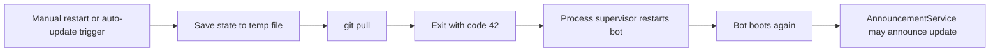

# Auto-update and restart behavior

This page explains the bot's **git-aware restart model** so it feels predictable instead of spooky.

## The three moving parts

| Component | Responsibility |
| --- | --- |
| `AutoUpdateService` | Periodically checks for remote git updates when enabled |
| `RestartHandler` | Saves state, pulls code, and exits with restart code `42` |
| `AnnouncementService` | Announces relevant updates after the bot comes back up |

Relevant code:

- `src/services/auto_update_service.py`
- `src/services/restart_handler.py`
- `src/services/announcement_service.py`

## The two config switches that matter most

| Variable | Meaning |
| --- | --- |
| `KEEP_UP_TO_DATE_WITH_GIT=true` | Enable periodic git polling and restart when updates are detected |
| `KEEP_UP_TO_DATE_WITH_GIT=false` | Disable automatic update polling |
| `QUIET_UPDATES=true` | Suppress update announcements after restart |
| `QUIET_UPDATES=false` | Allow update announcements when appropriate |

## Diagram: restart lifecycle

## What actually happens during a restart

The restart path is intentional and stateful:

1. the bot marks restart as in progress
2. it saves state to a temp file
3. it performs `git pull`
4. it pauses briefly for final operations
5. it exits with code `42`

That exit code is a signal to the **outer supervisor**, not an error to be ignored.

## Manual restart: `/restart`

The `/restart` command uses the same restart handler as the auto-update path.

That means `/restart` is effectively:

- save state
- `git pull`
- exit for supervised restart

If you expected “just restart the process,” that is not what this command does.

## Automatic updates

When enabled, `AutoUpdateService` monitors the git repository on an interval and can trigger the same restart flow after update detection.

### Good environments for auto-update

| Environment trait | Why it helps |
| --- | --- |
| Real git checkout | The service fetches/pulls from git |
| Stable remote/auth configuration | Updates must be retrievable |
| Supervisor-managed process | The bot exits during restart |
| Predictable working directory | Git commands depend on it |

### Bad environments for auto-update

| Environment trait | Why it is risky |
| --- | --- |
| Read-only or immutable deploy | `git pull` is not the right update mechanism |
| No supervisor | Bot exits and stays down |
| Detached/unmanaged working tree | Git update behavior becomes unreliable |

## Update announcements after restart

`AnnouncementService` decides whether to broadcast an update notice after startup.

### Important nuance

An announcement is not sent just because the bot restarted.

The service checks things like:

- whether `QUIET_UPDATES` is enabled
- whether the current git SHA changed
- whether there are active channels to announce to
- whether the changelog contains announcement-worthy commits

If no relevant changelog is found, the service can intentionally skip the announcement.

## Recommended usage by environment

| Environment | Recommendation |
| --- | --- |
| Local development | Prefer `KEEP_UP_TO_DATE_WITH_GIT=false` and use `make run-direct` |
| Long-running self-hosted bot | Auto-update can be reasonable if git and supervision are set up well |
| Production-like managed environment | Enable only if git-pull-based updates are truly part of the deployment model |

## Important local-development caveat

The repository's `start.sh` wrapper assumes a `venv/` virtualenv path when reinstalling dependencies after restart.

The Makefile, however, creates `.venv/` by default.

### If you use wrapper-based restart locally

Choose one:

- create/use `venv/`
- modify the wrapper for your environment
- skip the wrapper and use `make run-direct`

## Practical mental model

- `/restart` is a **git-aware restart**, not a simple reload
- exit code `42` is **expected** during restart
- a process supervisor is part of the design
- announcements are **conditional**, not guaranteed

## See also

- `docs/deployment.md`
- `docs/development.md`
- `docs/troubleshooting.md`
